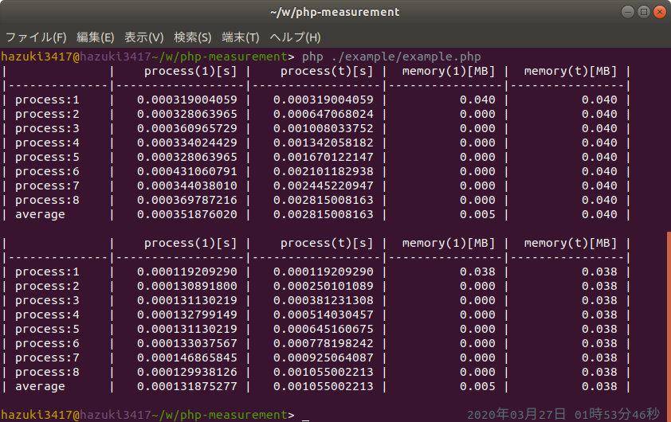

  [](//packagist.org/packages/hazuki3417/php-measurement) [](//packagist.org/packages/hazuki3417/php-measurement) [](//packagist.org/packages/hazuki3417/php-measurement) [](//packagist.org/packages/hazuki3417/php-measurement) 

<!--   -->
    

[](https://codeclimate.com/github/hazuki3417/php-measurement/maintainability) [](https://codeclimate.com/github/hazuki3417/php-measurement/test_coverage)

[English](README.md) | [日本語](README.ja.md)

# 概要

このパッケージはPHPプログラムの実行速度をチェックします。  
このパッケージを用いることでリファクタリングなどの作業を支援します。

## 要件
 - php 5.6以上
 

## インストール

パッケージをインストールするには、ターミナルから下記のコマンドを実行します。

```sh
composer require --dev hazuki3417/php-measurement
```

※開発支援用のパッケージですので、`--dev`オプションを付与してインストールすることを推奨します。


## 使い方

### 1. インスタンスを生成
`use`演算子を利用して`Performance`クラスのエイリアスを作成し、インスタンスを生成します。  

```php
include dirname(__DIR__) . '/vendor/autoload.php';

// Performanceクラスのエイリアスを作成
use Selen\Measurement\Performance;

// インスタンスを生成
$perf = new Performance();

```

名前空間を指定して`Performance`クラスのインスタンスを生成する方法でも良いです。

```php
include dirname(__DIR__) . '/vendor/autoload.php';

// 名前空間を指定してインスタンスを生成
$perf = Selen\Measurement\Performance();

```

### 2. 計測

試しに変数の型が同じときと異なるときの加算処理にかかる時間を計測します。


```php
<?php
include dirname(__DIR__) . '/vendor/autoload.php';

use Selen\Measurement\Performance;

$perf1 = new Performance();

$perf1->set(function () {
    $sum = '1';
    $result = 0;
    for($i = 1; $i < 10000; $i++){
        $result += $sum;
    }
})->start(8);


$perf2 = new Performance();

$perf2->set(function () {
    $sum = 1;
    $result = 0;
    for($i = 1; $i < 10000; $i++){
        $result += $sum;
    }
})->start(8);

```


## 出力結果

計測結果です。




|列|説明|単位|
|---|---|---|
|process(1)[s]|1回あたりの実行時間|秒|
|process(t)[s]|累計の実行時間|秒||
|process(1)[MB]|1回あたりのメモリ使用量|メガバイト|
|process(t)[MB]|累計のメモリ使用量|メガバイト|

|行|説明|
|---|---|
|process:~|1回あたりの結果値|
|average|実行回数の平均値|

```
NOTE: 計測結果は環境によって異なります。
```

## コード解析、成果物など

 - [API Documentation](https://php-measurement.s3-ap-northeast-1.amazonaws.com/phpdoc/index.html)
 - [Coverage](https://php-measurement.s3-ap-northeast-1.amazonaws.com/coverage/index.html)
 - [Code Climate](https://codeclimate.com/github/hazuki3417/php-measurement)

