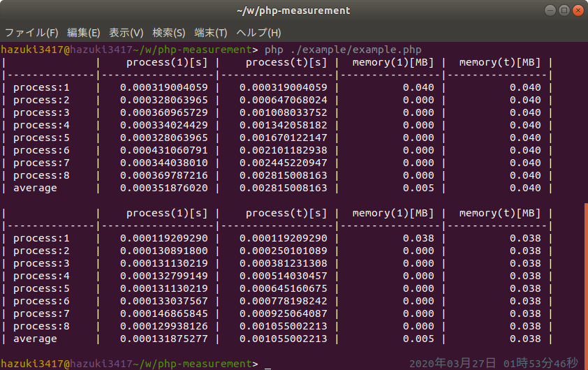

  [](//packagist.org/packages/hazuki3417/php-measurement) [](//packagist.org/packages/hazuki3417/php-measurement) [](//packagist.org/packages/hazuki3417/php-measurement) [](//packagist.org/packages/hazuki3417/php-measurement) 

<!--   -->
    

[](https://codeclimate.com/github/hazuki3417/php-measurement/maintainability) [](https://codeclimate.com/github/hazuki3417/php-measurement/test_coverage)

[English](README.md) | [日本語](README.ja.md)

# Overview

This package checks the execution speed of PHP programs.
Use this package to support tasks such as refactoring.

## Requirement
- php 5.6 or higher
 

## Install

To install the package, execute the following command from the terminal.

```sh
composer require --dev hazuki3417/php-measurement
```

Since it is a package for development support, it is recommended to install it with the `--dev` option.


## Usage

### 1. Create instance
Create an instance of the `Performance` class using the` use` operator and create an instance.  
(Or specify a namespace and create an instance of the `Performance` class.)

```php
include 'vendor/autoload.php';

// Create an alias for the Performance class
use Selen\Measurement\Performance;

// Create instance
$perf = new Performance();

```

```php
include 'vendor/autoload.php';

// Create instance by specifying namespace
$perf = Selen\Measurement\Performance();

```

### 2.Measurement

```php
include 'vendor/autoload.php';

use Selen\Measurement\Performance;

$perf1 = new Performance();

$perf1->set(function () {
    $sum = '1';
    $result = 0;
    for($i = 1; $i < 10000; $i++){
        $result += $sum;
    }
})->start(8);
```


## Output result




| Column | description | unit |
| --- | --- | --- |
| process (1) [s] | Execution time per run | sec |
| process (t) [s] | Total execution time | sec ||
| process (1) [MB] | Memory usage per time | Megabyte |
| process (1) [MB] | Total memory usage | megabytes |

| Row | description |
| --- | --- |
| process: ~ | Result value per time |
| average | Average number of executions |

## Other information

Coding convention: PSR2


## License
[MIT](https://github.com/hazuki3417/php-measurement/blob/master/LICENSE)

## Author

[hazuki3417](https://github.com/hazuki3417)
